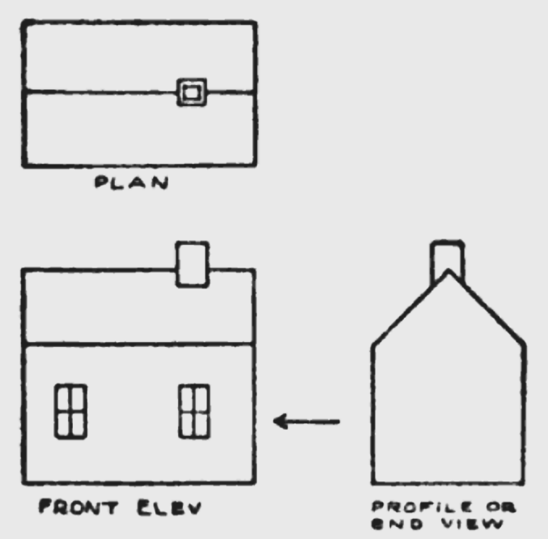

# Views

> Point of view is worth 80 IQ points.
>
> —[Alan Kay](https://quoteinvestigator.com/2018/05/29/pov/)

Supporting the {{link Techniques}} in this book are a number of **views**. A view is a way of looking at things. To put it another way, a view is what you see when you look at some part of the world from a particular metaphorical angle.

Views matter because they give us an effective way of seeing. Like an architect's plan, a view describes the world in terms that clarify how we might act on it via techniques.

However, just as the plan of a building doesn't tell us what it will look like from the front, a view isn't the whole picture. In order to build mental models that capture all the facets of reality, we need to combine multiple views.

<figure style="max-width: 400px" >

<figcaption>Orthographic multiview projection of a simple house, showing the plan and two elevations. From <i>Radford's Mechanical Drawing</i> (1912).</figcaption>
</figure>

Accordingly, I often use collections of multiple views in this book when investigating complex topics. For instance, the next section ({{link SoftwareDevelopment/index SoftwareDevelopment}}) opens with a collection of views of programming. Sometimes I present only one view of a topic, e.g. {{link Centers}}. This is generally not because that view is the only useful one, but because the other views are common knowledge and I don't think there's a need to reiterate them.

In any case, it's important to remember that views are not *true*. They are, necessarily, simplified descriptions of reality, that can't account for every complication. The question you should ask of a view is not "is it true" but "when is it useful?"

For example, I might show you a program and say "this program has no {{link State}}." You might protest "but it caches the result of some calculations, and those caches have state." "Well, if we just want to describe the program's {{link Behavior}}, we can pretend it has no state." "But the caches affect performance." "Well, for now we can pretend computers are infinitely fast." Views are all about simplifying things in this way — removing detail until we are left with only what is essential to serve our current purpose.

## Views Versus Models

A _mental model_ is a holistic understanding of a system. Mental models are what allow us to make predictions about the future. They let us simulate the system in our heads, and imagine what it will do in response to some outside stimulus or change.

A weakness of mental models is that they can never be fully explicated or communicated from person to person—a point that Peter Naur makes well in his essay ["Programming as Theory Building."](https://gwern.net/doc/cs/algorithm/1985-naur.pdf) He uses the word **theory** where I use "mental model", but it's the same idea.

Indeed, I would go so far as to say that a mental model is not _built_, but _grown_. It is rooted in a particular mind, developed through the interaction of that mind with the world, and can never be moved.

Because we can't directly communicate our mental models to each other, we need views. Views are more teachable than mental models—we can explain how to obtain them, draw pictures representing them, and so forth. The downside of views is that, in general, no single view presents a comprehensive picture of the system it describes. But by combining many complementary views together, we can form working mental models much more easily. <!-- Possibly related: https://en.wikipedia.org/wiki/Semantic_view_of_theories and https://en.wikipedia.org/wiki/Scientific_theory#Differences_between_theory_and_model -->

## Views and Techniques

Views and techniques go together. A common saying, often attributed to Abraham Maslow (though he never said it in so many words) is "if all you have is a hammer, all you will see are nails." But the converse is also true: if you see the world in terms of nails, the only tool you will be able to imagine is a hammer. The diversity of views presented in this book is necessary to support the many different techniques we will cover.

Here's an example of views, techniques, and principles all working together. Say you're working on some code that's difficult to understand: you have to jump around between many different files and functions to figure out what it's doing. The view {{link DependencyGraph}} gives you a way to make sense of the code in spite of its complexity. The principle {{link ShallowHierarchies}} builds on this view, identifying a specific property that makes the code frustrating to work with — the dependency graph is too deep. Techniques like {{link InlineFunction}} and {{link InvertControl}} apply the principle, giving you concrete ways to fix the problematic code.