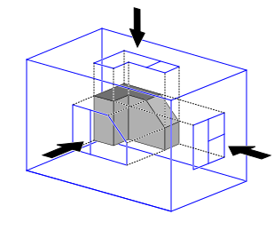

# Note on Models

The universe of our conscious experience is largely made up of the mental models that we use to explain and predict phenomena. These models are inventions: simplified descriptions of the ungraspable underlying reality. Because they are simplified, models are flawed. There are some aspects of the underlying reality that they don't describe, and accordingly there are some phenomena they don't predict. Every model makes a tradeoff between fidelity (how many phenomena it accounts for) and usability (how easy it is to understand and apply). As George Box put it, "All models are wrong; some models are useful."

As one example, take two famous descriptions of physics: Newton's mechanics and Einstein's general relativity. Einstein's model of the universe accounts for more observations, but is much harder to understand and apply than Newton's model. Said a different way, Newtonian mechanics is known to be flawed: it breaks down when trying to describe objects moving at near lightspeed. But we still use Newtonian physics for many practical matters like bridge-building and ballistics, because it is relatively simple.

This book presents many different models of various aspects of the software development process, from team structure down to the details of code. You may find places where the models contradict each other. That is expected. You may also find places where a model is silent on some point, or doesn't account for some complication that you notice in the real world. That is also expected. The point of each model is not to be the be-all and end-all description, but to be a partial, comprehensible, and therefore _useful_ description.

A possible analogy is to multiview projection in physical engineering fields. Each view of an object is an incomplete description of that object. However, each view has the advantage of being two-dimensional, and therefore tractable in a way that three-dimensional representations aren't. You can't expect any single view of the object to describe everything about it. But if you have lots of different views, you can probably find one that helps you understand what you need to understand about it.

<figure>

<figcaption>Multiview projection showing three orthographic views of a 3-D object. Source: <a href="https://commons.wikimedia.org/wiki/File:Third_angle_projecting.svg">Wikimedia Commons</a></figcaption>
</figure>
