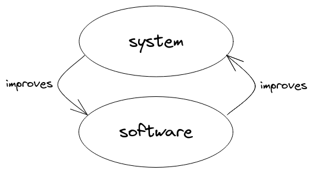

# Summary of the book in 256 words

I set out to write a book for programmers about how to make better software. But I realized that the only way to make software better is to make the world better. So here we go.

Software production takes place within a vast system of interacting parts. These parts include people, computers, apps, services, teams, meetings, processes, and companies. Because the system contains people, it has inherent value. The measure of its health is the degree to which people are kind to each other, and feel ownership of & love for their environment.

Improving the *whole system* is both the motive and the method for improving software.

- It's the method, because the system is what creates the software. If you want lasting improvement to the software, you have to change the system.
- It's the motive, because the system is the environment we live in, and software exists to make that environment pleasant.

In an ideal world, the software and the system would improve each other forever. Unfortunately, systems theory tells us that every positive feedback loop works as both a virtuous cycle and a vicious cycle, so the diagram above has an evil twin:

Bad systems produce bad software. Bad software makes the system harder to work in, hindering efforts to improve things.

How do we turn a bad system around? We start by creating relationships of mutual trust. People trust programmers who reliably deliver results; therefore, if you are a programmer, start by honing these skills: **test-driven and type-driven design, refactoring, and communication**.